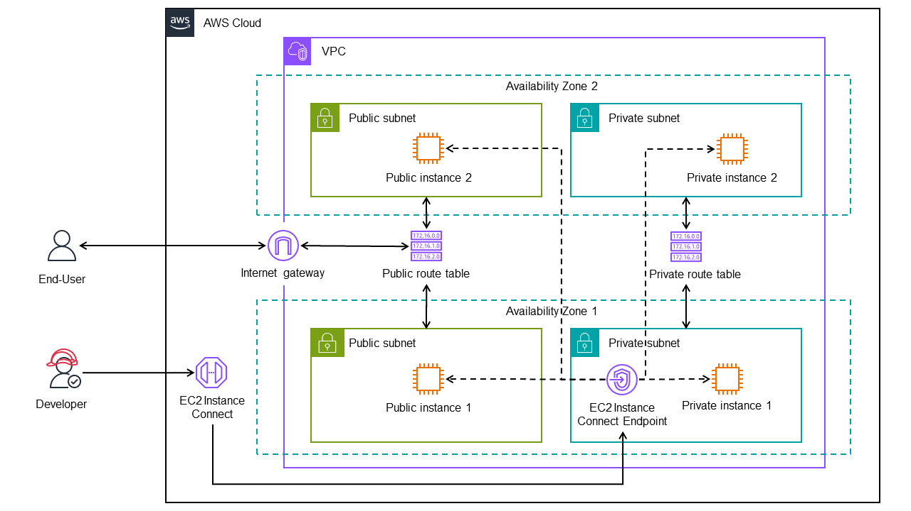

# AWS-Terraform Use Case 1

A use case for needing 1 public and 1 private subnet for each of the 2 availability zones. The instances in the public subnets can access the internet through the route to the Internet Gateway while the instances in the private subnets cannot. The public instances need to be accessed by developers in a variety of ways. On the other hand, the private instances can only be accessed via an EC2 Instance Connect Endpoint.



## Definition of Done

- The VPC from the AWS Management Console has the **resource map** similar with the diagram.
- The instances in the public subnets can be accessed using **EC2 Instance Connect**, **EC2 Instance Connect Endpoint**, **Session Manager** and **SSH Client**. These instances **can** access the Internet.
- The instances in the private subnets can only be access via **EC2 Instance Connect Endpoint**. These instances **cannot** access the Internet.

## Run

### 1. Credentials

Create a `.tf` file with the following template:

```hcl
provider "aws" {
  region     = "..."
  access_key = "..."
  secret_key = "..."
}
```

### 2. Apply

```hcl
terraform init
terraform plan
terraform apply
```

### 3. Destroy

```hcl
terraform destroy
```

## Access the instances via SSH

```bash
terraform output -raw private_key > tf_test_key_pair.pem
chmod 400 "tf_test_key_pair.pem"
ssh -i "tf_test_key_pair.pem" ec2-user@<PublicIP>
```
